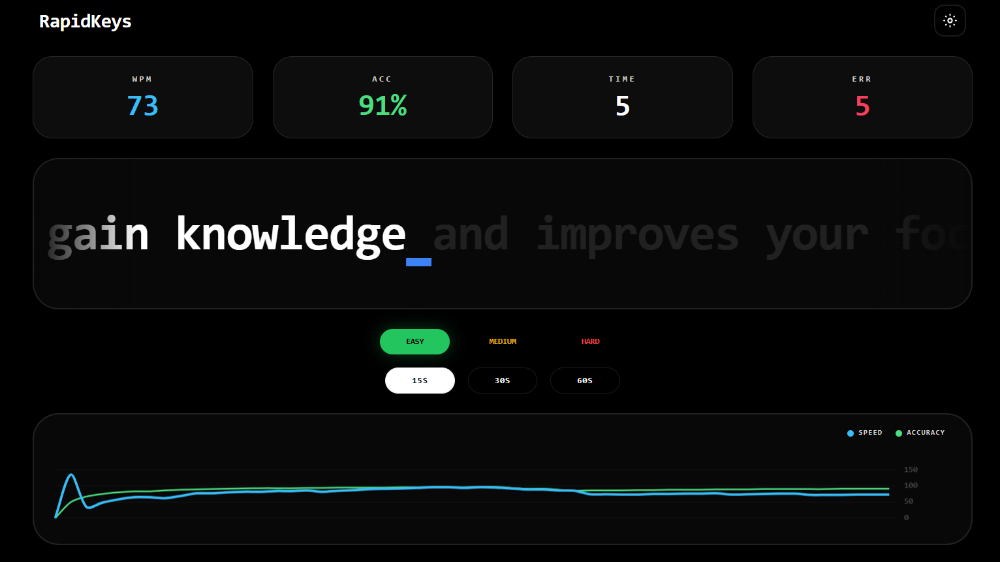
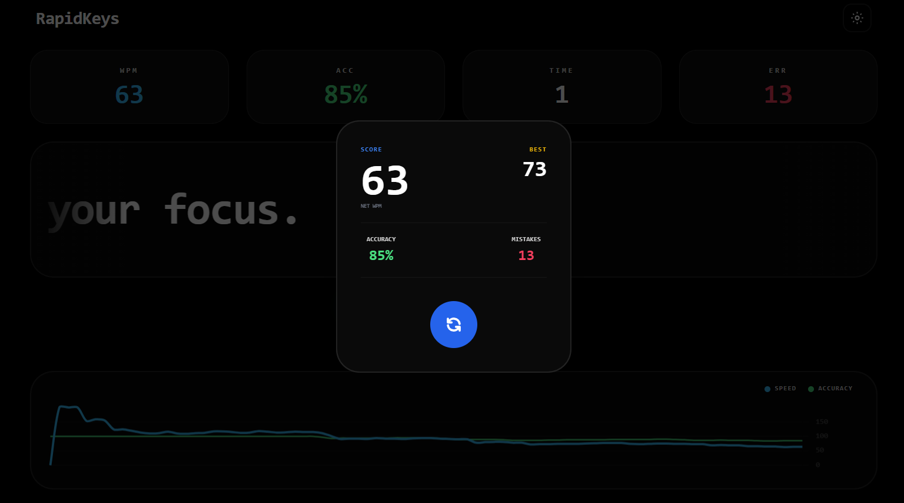

RapidKeys is a typing speed test built with React and TailwindCSS, tracking WPM, accuracy, and errors in real-time with a live chart. Supports difficulty levels, custom durations, and dark/light themes.

Live Demo: (https://rapidkeys-react-hvd8.vercel.app/)

 

Features:
- Real-time WPM, accuracy, and errors
- Difficulty: Easy, Medium, Hard
- Duration: 15s, 30s, 60s
- Live chart of performance
- High score tracking in localStorage
- Responsive and modern UI

Installation:
git clone https://github.com/gautamsonpitale17/rapidkeys-react
cd rapidkeys-react
npm install
npm start

Usage:
- Choose difficulty and duration
- Start typing to begin the test
- Monitor your WPM, accuracy, and errors
- Reset to try a new sentence

Tech:
React | TailwindCSS | Chart.js
